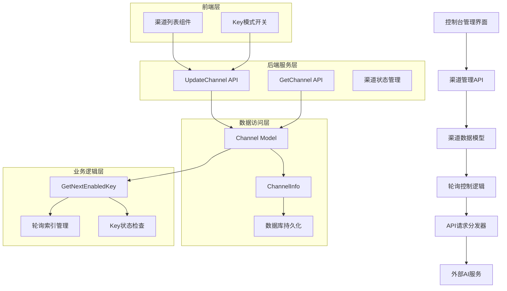
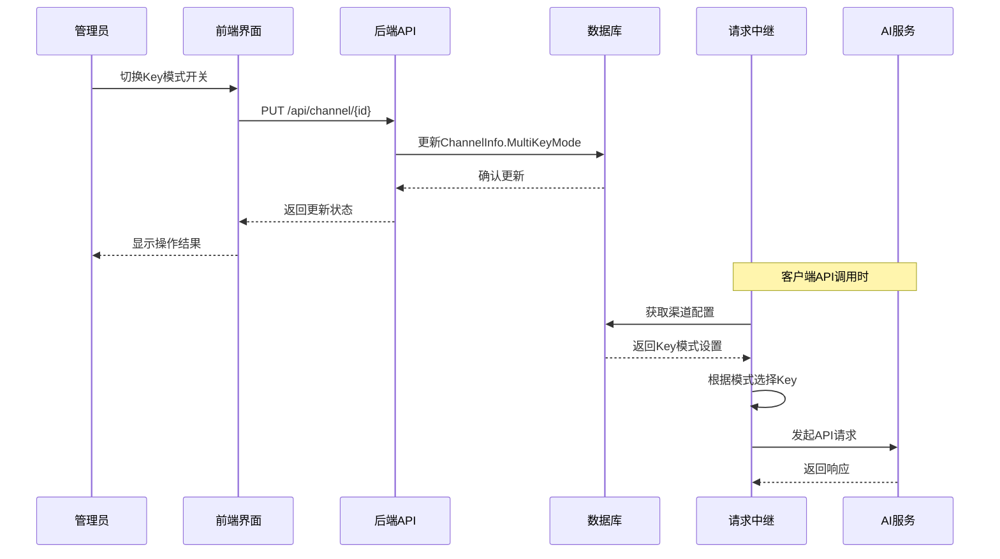
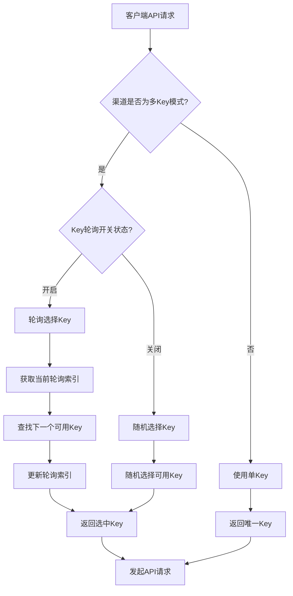

# 渠道Key轮询模式功能设计文档

## 1. 概述

### 功能背景
New API项目目前支持多Key模式的随机选择和轮询模式，但轮询模式只在渠道创建时配置，缺乏动态控制能力。本功能将在渠道列表界面增加Key轮询模式的开关控制，允许管理员动态启用/禁用单个渠道的Key轮询功能。

### 核心价值
- 提升渠道管理的灵活性
- 支持渠道Key使用策略的动态调整
- 优化API调用的负载均衡能力
- 增强系统的可运维性

### 功能目标
在`/console/channel`渠道列表页面新增"Key模式"列，提供开关控制：
- **开启状态**：该渠道在调用`/v1/models`、`/v1/chat/completions`等API时使用轮询模式
- **关闭状态**：保持原有逻辑（随机模式或单Key模式）

## 2. 架构设计

### 2.1 系统架构图



### 2.2 数据流架构



## 3. 功能设计

### 3.1 前端界面设计

#### 渠道列表界面增强
- **新增列名**：Key模式
- **显示组件**：Switch开关组件
- **状态显示**：
  - 开启：显示"轮询"标签，绿色
  - 关闭：显示"随机"标签，灰色
- **交互逻辑**：
  - 点击开关立即触发API调用
  - 显示加载状态
  - 操作完成后更新界面状态

#### 界面布局设计
```
| ID | 名称 | 类型 | 状态 | Key模式 | 优先级 | 操作 |
|----|------|------|------|---------|--------|------|
| 1  | GPT  | OpenAI | 启用 | [轮询开关] | 100 | [编辑][删除] |
| 2  | Claude | Anthropic | 启用 | [随机开关] | 90 | [编辑][删除] |
```

### 3.2 后端API设计

#### 渠道更新API扩展
**接口路径**: `PUT /api/channel/`

**请求参数扩展**:
```json
{
  "id": 1,
  "key_polling_enabled": true,
  "其他现有字段": "..."
}
```

**响应结构**:
```json
{
  "success": true,
  "message": "",
  "data": {
    "id": 1,
    "channel_info": {
      "is_multi_key": true,
      "multi_key_mode": "polling"
    }
  }
}
```

#### Key模式切换API
**接口路径**: `PATCH /api/channel/{id}/key-mode`

**请求参数**:
```json
{
  "enabled": true
}
```

**响应结构**:
```json
{
  "success": true,
  "message": "Key轮询模式已启用",
  "data": {
    "channel_id": 1,
    "key_mode": "polling",
    "updated_time": "2024-01-15T10:30:00Z"
  }
}
```

### 3.3 数据模型设计

#### ChannelInfo结构扩展
当前结构已支持MultiKeyMode字段，无需修改：
```go
type ChannelInfo struct {
    IsMultiKey           bool                  `json:"is_multi_key"`
    MultiKeySize         int                   `json:"multi_key_size"`
    MultiKeyStatusList   map[int]int           `json:"multi_key_status_list"`
    MultiKeyPollingIndex int                   `json:"multi_key_polling_index"`
    MultiKeyMode         constant.MultiKeyMode `json:"multi_key_mode"` // 已存在
}
```

#### Key模式常量定义
```go
const (
    MultiKeyModeRandom  MultiKeyMode = "random"   // 随机模式
    MultiKeyModePolling MultiKeyMode = "polling"  // 轮询模式
)
```

## 4. 核心实现逻辑

### 4.1 Key选择策略



### 4.2 轮询索引管理

#### 索引更新机制
```go
func (channel *Channel) GetNextPollingKey() (string, int, error) {
    if !channel.ChannelInfo.IsMultiKey || 
       channel.ChannelInfo.MultiKeyMode != constant.MultiKeyModePolling {
        return channel.Key, 0, nil
    }
    
    keys := channel.getKeys()
    if len(keys) == 0 {
        return "", 0, errors.New("no keys available")
    }
    
    // 线程安全的轮询索引管理
    lock := getChannelPollingLock(channel.Id)
    lock.Lock()
    defer lock.Unlock()
    
    // 获取当前索引并找到下一个可用Key
    currentIndex := channel.ChannelInfo.MultiKeyPollingIndex
    for i := 0; i < len(keys); i++ {
        idx := (currentIndex + i) % len(keys)
        if channel.isKeyEnabled(idx) {
            channel.ChannelInfo.MultiKeyPollingIndex = (idx + 1) % len(keys)
            return keys[idx], idx, nil
        }
    }
    
    return keys[0], 0, nil
}
```

### 4.3 状态一致性保证

#### 缓存同步机制
- **内存缓存**: 使用Redis保证多实例间状态同步
- **数据库持久化**: 定期将轮询索引写入数据库
- **故障恢复**: 服务重启时从数据库加载轮询状态

#### 并发控制
- **渠道级别锁**: 每个渠道独立的轮询锁
- **原子操作**: 轮询索引更新的原子性保证
- **状态检查**: Key可用性实时检查

## 5. 测试策略

### 5.1 单元测试

#### 前端组件测试
- **Switch组件**：状态切换和事件触发测试
- **API调用**：模拟请求和响应处理测试
- **状态管理**：界面状态更新的正确性测试

#### 后端逻辑测试
- **Key选择算法**：轮询和随机模式测试
- **并发场景**：多线程访问的安全性测试
- **边界条件**：无可用Key、单Key等场景测试

### 5.2 集成测试

#### API端到端测试
```
测试场景：启用轮询模式
1. 创建多Key渠道
2. 通过API启用轮询模式
3. 发起多次API请求
4. 验证Key使用的轮询顺序
5. 检查轮询索引的正确更新
```

#### 负载测试
```
测试场景：高并发Key轮询
1. 配置100个并发请求
2. 验证轮询的公平性
3. 检查性能指标
4. 确认无竞态条件
```

### 5.3 功能测试

#### 界面交互测试
- 开关状态的实时更新
- 错误处理和用户提示
- 权限控制和访问限制

#### 业务逻辑测试
- 轮询模式下的Key分布均匀性
- 禁用Key的自动跳过
- 故障Key的自动切换

## 6. 部署方案

### 6.1 数据库迁移

#### 兼容性保证
当前ChannelInfo结构已包含MultiKeyMode字段，无需额外迁移：
```sql
-- 无需执行，字段已存在
-- ALTER TABLE channels ADD COLUMN channel_info JSON;
```

#### 默认值设置
```sql
-- 为现有多Key渠道设置默认模式
UPDATE channels 
SET channel_info = JSON_SET(
    COALESCE(channel_info, '{}'), 
    '$.multi_key_mode', 
    'random'
) 
WHERE JSON_EXTRACT(channel_info, '$.is_multi_key') = true 
AND JSON_EXTRACT(channel_info, '$.multi_key_mode') IS NULL;
```

### 6.2 配置更新

#### 前端配置
```json
{
  "features": {
    "channelKeyPolling": true,
    "keyModeToggle": true
  },
  "ui": {
    "channelTable": {
      "columns": ["id", "name", "type", "status", "keyMode", "priority", "actions"]
    }
  }
}
```

#### 后端配置
```yaml
channel:
  key_polling:
    enabled: true
    cache_ttl: 300
    polling_lock_timeout: 5
```

### 6.3 发布策略

#### 灰度发布计划
1. **阶段1**: 后端API部署，保持向下兼容
2. **阶段2**: 前端界面更新，渐进式功能开放
3. **阶段3**: 全量发布，监控系统表现

#### 回滚预案
- **前端回滚**: 隐藏Key模式列，回退到原界面
- **后端回滚**: API保持兼容，默认使用随机模式
- **数据回滚**: 恢复MultiKeyMode为random值

## 7. 监控方案

### 7.1 性能监控

#### 关键指标
- **Key选择延迟**: 轮询模式下的Key选择时间
- **并发性能**: 多线程访问的吞吐量
- **缓存命中率**: 渠道配置的缓存使用情况

#### 监控面板
```
渠道Key轮询监控面板
├── Key选择性能
│   ├── 平均选择时间
│   ├── P99延迟
│   └── 错误率
├── 轮询分布
│   ├── Key使用均匀性
│   ├── 轮询成功率
│   └── 故障转移次数
└── 系统资源
    ├── 锁竞争次数
    ├── 缓存使用率
    └── 数据库连接数
```

### 7.2 业务监控

#### 告警规则
- **Key选择失败率 > 5%**: 发送告警通知
- **轮询分布不均 > 20%**: 业务异常告警
- **锁竞争超时 > 100次/分钟**: 性能告警

#### 日志记录
```go
// Key选择日志
log.Info("Key selected", 
    "channel_id", channelId,
    "key_index", keyIndex, 
    "mode", "polling",
    "duration", duration)

// 模式切换日志
log.Info("Key mode toggled",
    "channel_id", channelId,
    "old_mode", oldMode,
    "new_mode", newMode,
    "operator", userId)
```

## 8. 风险评估

### 8.1 技术风险

#### 并发竞争风险
- **风险**: 高并发下轮询索引的竞态条件
- **缓解**: 使用渠道级别的分布式锁
- **监控**: 锁竞争和超时的监控告警

#### 性能影响风险
- **风险**: 轮询模式可能增加响应延迟
- **缓解**: 优化锁粒度，使用内存缓存
- **监控**: 设置性能基线和告警阈值

### 8.2 业务风险

#### 数据一致性风险
- **风险**: 缓存与数据库状态不一致
- **缓解**: 实现缓存失效和重试机制
- **监控**: 定期数据一致性检查

#### 用户体验风险
- **风险**: 界面操作无响应或错误提示不清晰
- **缓解**: 增加加载状态和详细错误信息
- **监控**: 前端错误上报和用户行为分析

### 8.3 运维风险

#### 配置错误风险
- **风险**: 错误的Key模式配置导致服务异常
- **缓解**: 配置验证和安全默认值
- **监控**: 配置变更审计和自动回滚

#### 容量规划风险
- **风险**: 轮询机制增加系统负载
- **缓解**: 性能测试和容量评估
- **监控**: 资源使用率和性能趋势分析