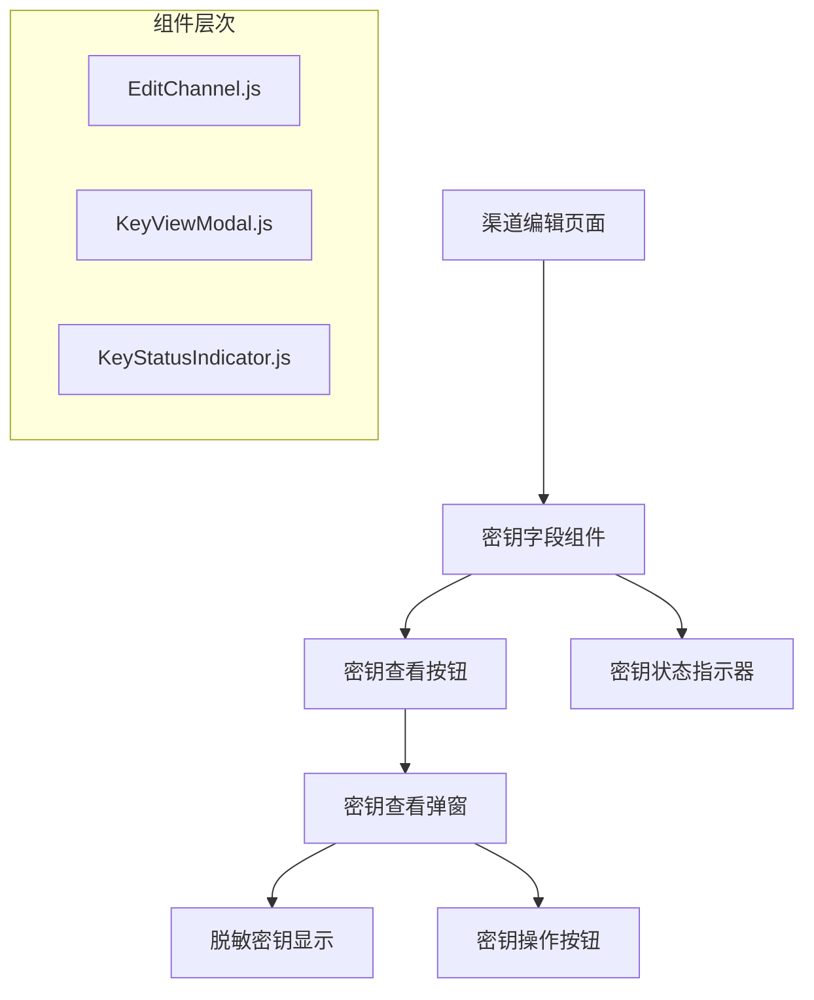
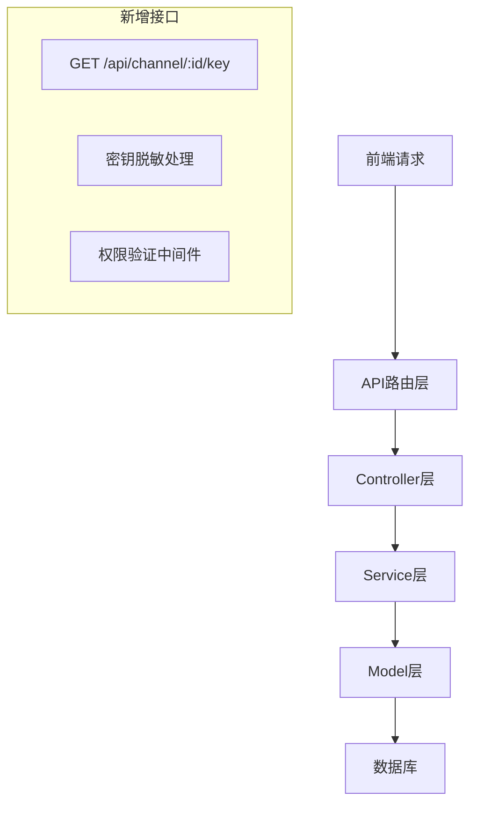
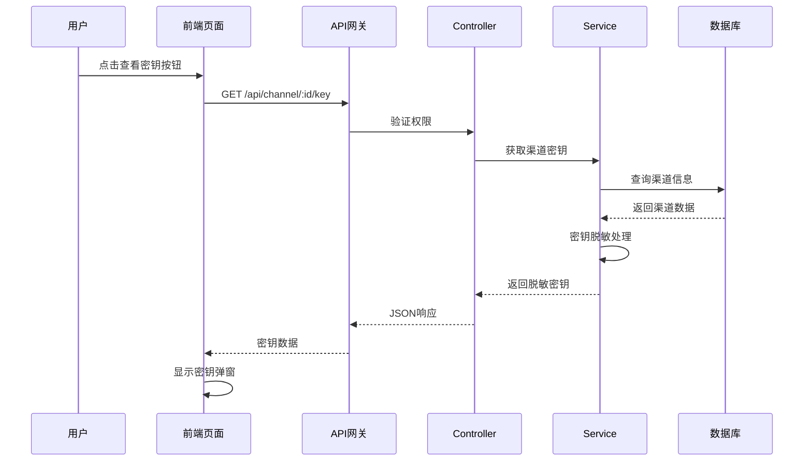
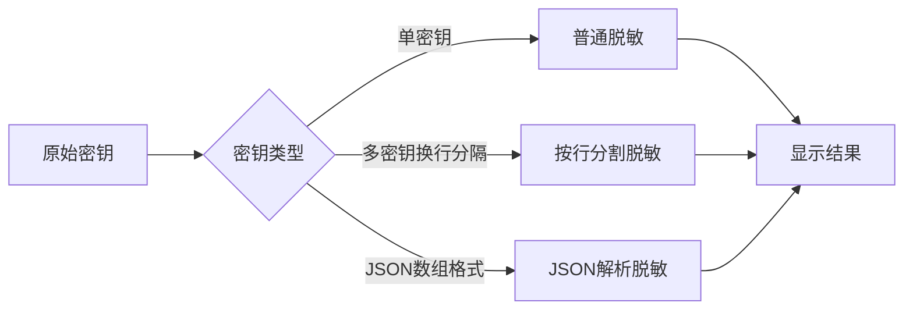
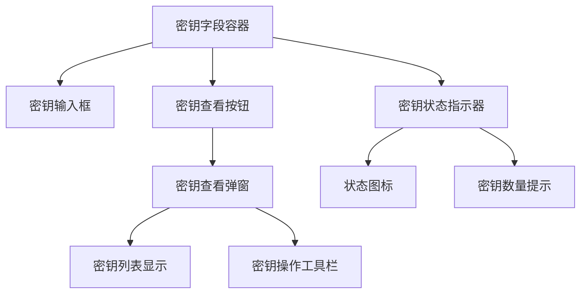
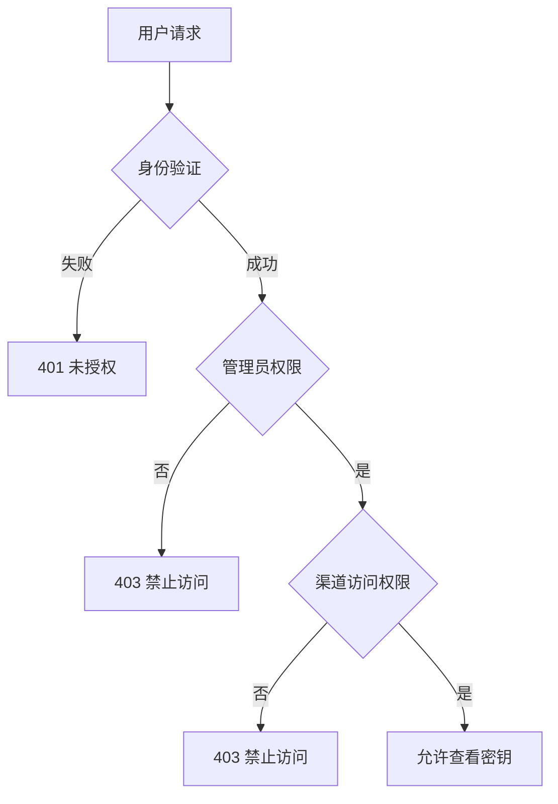

# 渠道密钥查看功能设计文档

## 1. 概述

本设计文档旨在为 New API 项目的渠道管理功能增加密钥查看能力。用户在 `/console/channel` 页面的渠道列表中点击编辑进入渠道编辑页面时，可以在密钥选项中查看当前配置的密钥信息。

## 2. 项目背景

New API 是一个大模型网关与 AI 资产管理系统，支持多种 AI 模型（OpenAI、Claude、Cohere 等）的统一接口访问。渠道管理是核心功能之一，管理员需要配置和维护各种 AI 服务商的密钥信息。

当前渠道编辑页面存在的问题：
- 编辑模式下密钥字段为空，无法查看现有配置
- 管理员无法确认当前密钥是否正确
- 缺乏密钥状态的可视化反馈

## 3. 功能需求

### 3.1 核心需求
- 在渠道编辑页面的密钥字段中增加"查看密钥"功能
- 支持查看当前配置的密钥内容（脱敏显示）
- 提供密钥状态指示器
- 支持多密钥模式的密钥查看

### 3.2 安全需求
- 密钥显示需要权限验证
- 敏感信息脱敏处理
- 操作日志记录

### 3.3 用户体验需求
- 直观的密钥查看界面
- 清晰的密钥状态反馈
- 便捷的密钥管理操作

## 4. 技术架构

### 4.1 前端架构



### 4.2 后端架构



## 5. 数据流设计

### 5.1 密钥查看流程



### 5.2 多密钥模式处理



## 6. 接口设计

### 6.1 新增API接口

#### 获取渠道密钥信息

**接口路径：** `GET /api/channel/:id/key`

**请求参数：**
```
路径参数：
- id: 渠道ID (必需)

查询参数：
- view_mode: 查看模式 (可选)
  - masked: 脱敏显示 (默认)
  - count: 仅显示密钥数量
```

**响应格式：**
```json
{
  "success": true,
  "message": "",
  "data": {
    "channel_id": 1,
    "key_type": "single", // single | multi_line | multi_json
    "key_count": 1,
    "keys": [
      {
        "index": 0,
        "masked_key": "sk-abc***xyz",
        "status": "active", // active | disabled | unknown
        "last_used": "2024-01-01T10:00:00Z"
      }
    ],
    "multi_key_mode": "random", // random | polling
    "is_multi_key": false
  }
}
```

### 6.2 现有接口调整

#### 渠道详情接口优化

**接口路径：** `GET /api/channel/:id`

**响应格式调整：**
```json
{
  "success": true,
  "data": {
    // ... 现有字段
    "key": "", // 编辑模式下密钥字段置空
    "has_key": true, // 新增：是否配置了密钥
    "key_count": 3, // 新增：密钥数量
    "key_status": "active" // 新增：密钥状态
  }
}
```

## 7. 前端组件设计

### 7.1 密钥字段组件增强

在 `EditChannel.js` 中的密钥字段区域增加查看功能：



### 7.2 密钥查看弹窗组件

**组件位置：** `web/src/components/channel/KeyViewModal.js`

**组件功能：**
- 密钥列表展示（脱敏）
- 密钥状态显示
- 复制功能（管理员权限）
- 密钥测试功能

### 7.3 密钥状态指示器组件

**组件位置：** `web/src/components/channel/KeyStatusIndicator.js`

**状态类型：**
- 活跃状态：绿色圆点 + 密钥数量
- 部分失效：黄色警告 + 失效数量
- 全部失效：红色错误 + 提示信息
- 未配置：灰色圆点 + "未配置"

## 8. 数据模型

### 8.1 密钥查看响应模型

```typescript
interface ChannelKeyViewResponse {
  channel_id: number;
  key_type: 'single' | 'multi_line' | 'multi_json';
  key_count: number;
  keys: ChannelKeyInfo[];
  multi_key_mode: 'random' | 'polling';
  is_multi_key: boolean;
}

interface ChannelKeyInfo {
  index: number;
  masked_key: string;
  status: 'active' | 'disabled' | 'unknown';
  last_used: string;
  error_message?: string;
}
```

### 8.2 前端状态管理

```typescript
interface KeyViewState {
  visible: boolean;
  loading: boolean;
  keyData: ChannelKeyViewResponse | null;
  selectedKeyIndex: number;
  viewMode: 'masked' | 'count';
}
```

## 9. 安全设计

### 9.1 权限控制



### 9.2 密钥脱敏策略

| 密钥类型 | 原始格式 | 脱敏格式 | 脱敏规则 |
|----------|----------|----------|----------|
| OpenAI | sk-abc123def456 | sk-abc***f456 | 保留前3位和后4位 |
| Claude | cl-abc123def456 | cl-abc***f456 | 保留前3位和后4位 |
| API Key | 1234567890abcdef | 123***cdef | 保留前3位和后4位 |
| 多段式 | key1\|key2\|key3 | key1\|***\|key3 | 中间段完全隐藏 |
| JSON | {"key":"value"} | {"key":"***"} | 敏感字段值隐藏 |

### 9.3 操作日志

密钥查看操作需要记录审计日志：

```json
{
  "action": "view_channel_key",
  "user_id": 1,
  "channel_id": 5,
  "timestamp": "2024-01-01T10:00:00Z",
  "ip_address": "192.168.1.100",
  "user_agent": "Mozilla/5.0..."
}
```

## 10. 实现步骤

### 10.1 后端实现

**阶段1：API接口开发**
1. 在 `controller/channel.go` 中添加 `GetChannelKey` 方法
2. 在 `router/api-router.go` 中注册新路由
3. 在 `service/channel.go` 中实现密钥脱敏逻辑
4. 添加权限验证中间件

**阶段2：密钥处理逻辑**
1. 实现多种密钥格式的解析
2. 添加密钥脱敏算法
3. 集成密钥状态检测
4. 添加操作日志记录

### 10.2 前端实现

**阶段1：组件开发**
1. 创建 `KeyViewModal` 组件
2. 创建 `KeyStatusIndicator` 组件
3. 修改 `EditChannel.js` 密钥字段区域
4. 添加密钥查看相关的状态管理

**阶段2：界面集成**
1. 在密钥字段旁添加查看按钮
2. 集成密钥状态指示器
3. 实现密钥查看弹窗
4. 添加密钥操作功能

### 10.3 测试验证

**阶段1：单元测试**
1. 密钥脱敏算法测试
2. API接口功能测试
3. 权限验证测试
4. 组件功能测试

**阶段2：集成测试**
1. 渠道编辑页面功能测试
2. 多密钥模式测试
3. 不同渠道类型测试
4. 安全性测试

## 11. 用户交互设计

### 11.1 密钥字段界面

```
┌─────────────────────────────────────────────┐
│ 密钥                               [查看] 🔍 │
├─────────────────────────────────────────────┤
│ ████████████████████████████████████████    │
│ (编辑模式下，保存的密钥不会显示)             │
│                                             │
│ ● 3个密钥 | ✅ 全部正常             [状态] │
└─────────────────────────────────────────────┘
```

### 11.2 密钥查看弹窗

```
┌─────────────────────────────────────────────┐
│ 渠道密钥信息                           [✕]  │
├─────────────────────────────────────────────┤
│ 渠道名称: OpenAI-GPT4                      │
│ 密钥模式: 多密钥轮询                        │
│                                             │
│ ┌─────────────────────────────────────────┐ │
│ │ #1 sk-proj***vwxyz  ✅正常    [复制]   │ │
│ │ #2 sk-proj***abcde  ⚠️失效    [测试]   │ │
│ │ #3 sk-proj***fghij  ✅正常    [复制]   │ │
│ └─────────────────────────────────────────┘ │
│                                             │
│ 最后更新: 2024-01-01 10:00:00               │
│                                             │
│                          [测试全部] [关闭] │
└─────────────────────────────────────────────┘
```

### 11.3 状态指示器

| 状态 | 图标 | 颜色 | 说明 |
|------|------|------|------|
| 全部正常 | ✅ | 绿色 | 所有密钥都可用 |
| 部分失效 | ⚠️ | 黄色 | 部分密钥不可用 |
| 全部失效 | ❌ | 红色 | 所有密钥都不可用 |
| 未配置 | ⭕ | 灰色 | 没有配置密钥 |
| 检测中 | 🔄 | 蓝色 | 正在检测密钥状态 |

## 12. 错误处理

### 12.1 API错误响应

```json
{
  "success": false,
  "message": "错误描述",
  "error_code": "CHANNEL_KEY_ACCESS_DENIED",
  "data": null
}
```

### 12.2 错误码定义

| 错误码 | 说明 | HTTP状态码 |
|--------|------|------------|
| CHANNEL_NOT_FOUND | 渠道不存在 | 404 |
| CHANNEL_KEY_ACCESS_DENIED | 密钥访问权限不足 | 403 |
| CHANNEL_KEY_DECRYPT_FAILED | 密钥解密失败 | 500 |
| CHANNEL_KEY_FORMAT_ERROR | 密钥格式错误 | 400 |

### 12.3 前端错误处理

```typescript
const handleKeyViewError = (error: APIError) => {
  switch (error.error_code) {
    case 'CHANNEL_KEY_ACCESS_DENIED':
      showError('您没有权限查看此渠道的密钥信息');
      break;
    case 'CHANNEL_NOT_FOUND':
      showError('渠道不存在或已被删除');
      break;
    default:
      showError('获取密钥信息失败: ' + error.message);
  }
};
```

## 13. 性能优化

### 13.1 缓存策略

- 密钥查看结果缓存5分钟
- 密钥状态检测结果缓存10分钟
- 渠道基本信息缓存15分钟

### 13.2 懒加载

- 密钥查看弹窗组件按需加载
- 密钥状态检测延迟执行
- 大量密钥时分页显示

### 13.3 请求优化

- 密钥状态检测批量进行
- 避免频繁的密钥查看请求
- 使用防抖机制减少API调用
