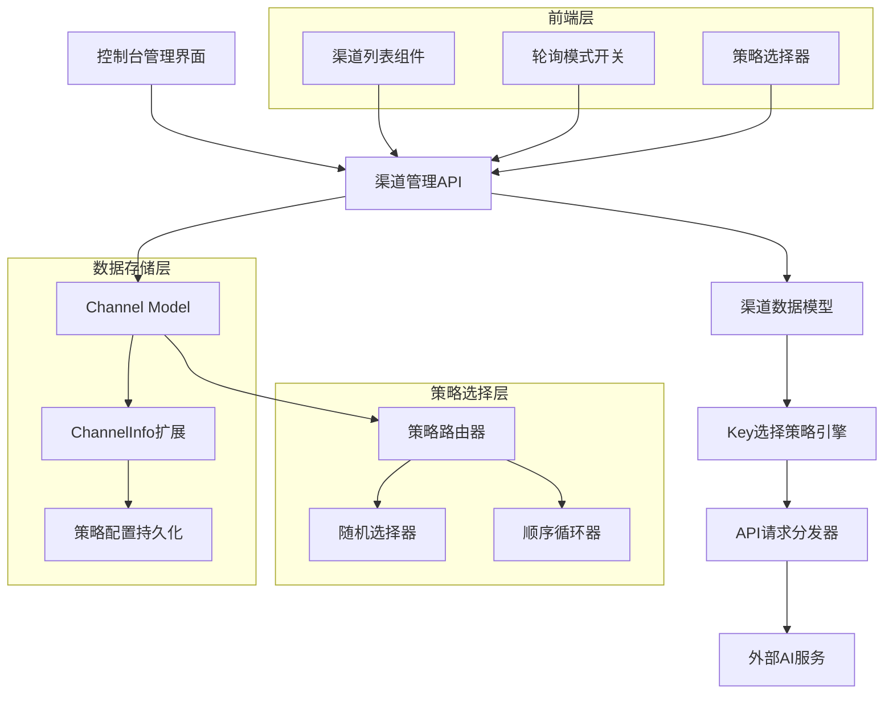
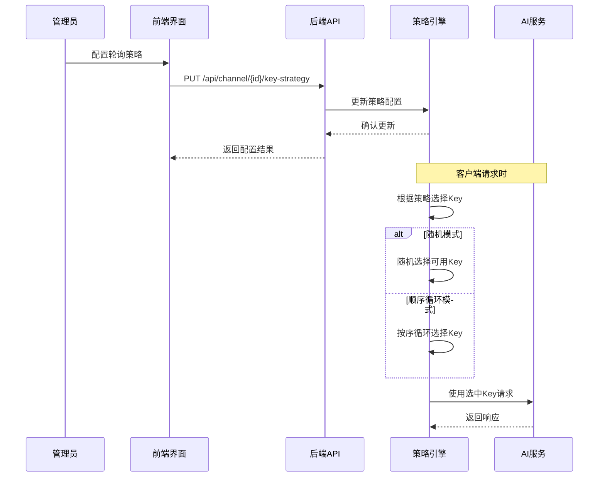
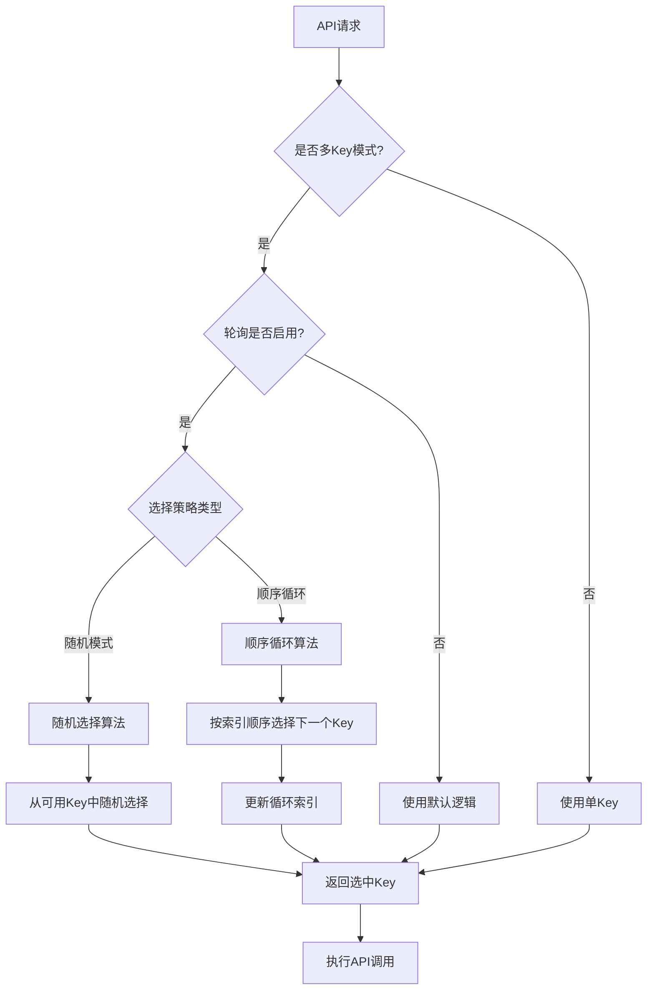

# 渠道Key轮询模式增强功能设计文档

## 1. 概述

### 功能背景
基于现有的渠道Key轮询模式功能，增强Key使用策略的细化控制。当前系统支持轮询开关，本次优化将在轮询模式下增加两种具体的Key使用方式：随机Key模式和顺序循环模式，提供更灵活的负载均衡策略。

### 核心价值
- 提供更细粒度的Key使用策略控制
- 优化不同场景下的负载均衡效果
- 增强渠道管理的灵活性和可控性
- 满足不同业务场景的Key分配需求

### 功能目标
在渠道列表页面的"Key模式"列增强功能：
- **轮询开关**：控制是否启用轮询模式
- **轮询策略选择**：当轮询开启时，提供两种策略选择
  - **随机Key模式**：在多个可用Key中随机选择
  - **顺序循环模式**：按Key顺序依次循环使用

## 2. 架构设计

### 2.1 系统架构图



### 2.2 数据流设计



## 3. 功能设计

### 3.1 前端界面设计

#### 渠道列表界面增强
```
| ID | 名称 | 类型 | 状态 | Key模式 | 轮询策略 | 优先级 | 操作 |
|----|------|------|------|---------|----------|--------|------|
| 1  | GPT  | OpenAI | 启用 | [轮询开关] | [随机▼] | 100 | [编辑] |
| 2  | Claude | Anthropic | 启用 | [关闭开关] | - | 90 | [编辑] |
```

#### 交互逻辑设计
- **轮询开关**：
  - 开启：显示"轮询"状态，策略选择器变为可用
  - 关闭：显示"单Key"状态，策略选择器变为灰色不可用
- **策略选择器**：
  - 选项：["随机Key", "顺序循环"]
  - 仅在轮询开关开启时可操作
  - 选择变更时立即触发API调用

### 3.2 后端API设计

#### Key策略配置API
**接口路径**: `PUT /api/channel/{id}/key-strategy`

**请求参数**:
```json
{
  "polling_enabled": true,
  "polling_strategy": "sequential"
}
```

**响应结构**:
```json
{
  "success": true,
  "message": "Key策略配置成功",
  "data": {
    "channel_id": 1,
    "polling_enabled": true,
    "polling_strategy": "sequential",
    "updated_time": "2024-01-15T10:30:00Z"
  }
}
```

#### 批量策略配置API
**接口路径**: `PATCH /api/channels/key-strategy`

**请求参数**:
```json
{
  "channel_ids": [1, 2, 3],
  "polling_enabled": true,
  "polling_strategy": "random"
}
```

### 3.3 数据模型设计

#### ChannelInfo结构扩展
```go
type ChannelInfo struct {
    IsMultiKey           bool                  `json:"is_multi_key"`
    MultiKeySize         int                   `json:"multi_key_size"`
    MultiKeyStatusList   map[int]int           `json:"multi_key_status_list"`
    MultiKeyPollingIndex int                   `json:"multi_key_polling_index"`
    
    // 扩展字段
    PollingEnabled       bool                  `json:"polling_enabled"`       // 是否启用轮询
    PollingStrategy      constant.KeyStrategy  `json:"polling_strategy"`      // 轮询策略
    SequentialIndex      int                   `json:"sequential_index"`      // 顺序循环索引
}
```

#### 策略常量定义
```go
type KeyStrategy string

const (
    KeyStrategyRandom     KeyStrategy = "random"     // 随机Key模式
    KeyStrategySequential KeyStrategy = "sequential" // 顺序循环模式
)
```

## 4. 核心实现逻辑

### 4.1 Key选择策略流程



### 4.2 随机Key选择算法
```go
func (c *Channel) selectRandomKey() (string, int, error) {
    availableKeys := c.getAvailableKeys()
    if len(availableKeys) == 0 {
        return "", 0, errors.New("no available keys")
    }
    
    // 使用加权随机算法
    selectedIndex := rand.Intn(len(availableKeys))
    keyIndex := availableKeys[selectedIndex]
    
    return c.getKeyByIndex(keyIndex), keyIndex, nil
}
```

### 4.3 顺序循环选择算法
```go
func (c *Channel) selectSequentialKey() (string, int, error) {
    availableKeys := c.getAvailableKeys()
    if len(availableKeys) == 0 {
        return "", 0, errors.New("no available keys")
    }
    
    // 线程安全的索引管理
    lock := getChannelSequentialLock(c.Id)
    lock.Lock()
    defer lock.Unlock()
    
    // 获取当前索引位置
    currentPos := c.ChannelInfo.SequentialIndex % len(availableKeys)
    keyIndex := availableKeys[currentPos]
    
    // 更新循环索引
    c.ChannelInfo.SequentialIndex = (currentPos + 1) % len(availableKeys)
    
    return c.getKeyByIndex(keyIndex), keyIndex, nil
}
```

### 4.4 统一Key选择入口
```go
func (c *Channel) GetNextEnabledKey() (string, int, error) {
    if !c.ChannelInfo.IsMultiKey {
        return c.Key, 0, nil
    }
    
    if !c.ChannelInfo.PollingEnabled {
        // 使用原有逻辑（兼容性保证）
        return c.getDefaultKey()
    }
    
    switch c.ChannelInfo.PollingStrategy {
    case constant.KeyStrategyRandom:
        return c.selectRandomKey()
    case constant.KeyStrategySequential:
        return c.selectSequentialKey()
    default:
        return c.selectRandomKey() // 默认使用随机模式
    }
}
```

## 5. 测试策略

### 5.1 单元测试
```go
func TestChannelKeySelection(t *testing.T) {
    // 测试随机模式
    t.Run("RandomStrategy", func(t *testing.T) {
        channel := createTestChannel()
        channel.ChannelInfo.PollingEnabled = true
        channel.ChannelInfo.PollingStrategy = constant.KeyStrategyRandom
        
        keyDistribution := make(map[string]int)
        for i := 0; i < 1000; i++ {
            key, _, _ := channel.GetNextEnabledKey()
            keyDistribution[key]++
        }
        
        // 验证分布的随机性
        assert.True(t, len(keyDistribution) > 1)
    })
    
    // 测试顺序循环模式
    t.Run("SequentialStrategy", func(t *testing.T) {
        channel := createTestChannel()
        channel.ChannelInfo.PollingEnabled = true
        channel.ChannelInfo.PollingStrategy = constant.KeyStrategySequential
        
        keys := []string{}
        for i := 0; i < 10; i++ {
            key, _, _ := channel.GetNextEnabledKey()
            keys = append(keys, key)
        }
        
        // 验证循环顺序
        assert.Equal(t, keys[0], keys[5]) // 5个Key的情况下
    })
}
```

### 5.2 集成测试
- **策略切换测试**：验证策略变更的实时生效
- **并发安全测试**：高并发下索引管理的正确性
- **故障恢复测试**：Key故障时的自动切换

### 5.3 性能测试
- **选择延迟**：不同策略下Key选择的性能对比
- **内存使用**：索引管理的内存开销
- **并发吞吐**：高并发场景下的处理能力

## 6. 部署与配置

### 6.1 数据库迁移
```sql
-- 为现有渠道设置默认策略配置
UPDATE channels 
SET channel_info = JSON_SET(
    COALESCE(channel_info, '{}'),
    '$.polling_enabled', false,
    '$.polling_strategy', 'random',
    '$.sequential_index', 0
)
WHERE JSON_EXTRACT(channel_info, '$.is_multi_key') = true;
```

### 6.2 配置项
```yaml
channel:
  key_strategy:
    default_strategy: "random"
    sequential_index_sync_interval: 30 # 秒
    random_seed_refresh_interval: 3600 # 秒
```

### 6.3 监控指标
- **策略分布统计**：各策略使用情况
- **Key使用均衡性**：不同策略下的Key分布
- **切换成功率**：策略变更的成功率
- **性能指标**：选择延迟和并发处理能力

## 7. 风险控制

### 7.1 兼容性风险
- **向下兼容**：保持现有API的完全兼容
- **数据迁移**：平滑的配置迁移策略
- **功能降级**：策略选择失败时的降级机制

### 7.2 性能风险
- **锁竞争**：顺序循环模式下的锁优化
- **内存泄漏**：索引管理的内存控制
- **缓存一致性**：分布式环境下的状态同步

### 7.3 业务连续性
- **故障隔离**：单个渠道策略异常不影响其他渠道
- **快速恢复**：提供策略重置和恢复机制
- **监控告警**：关键指标的实时监控和告警